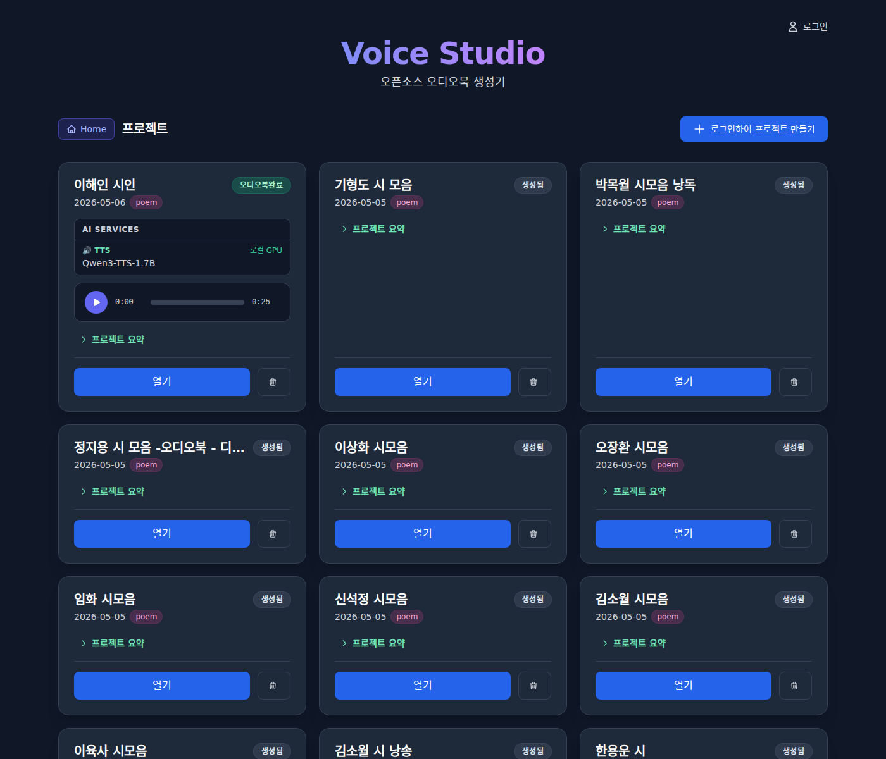
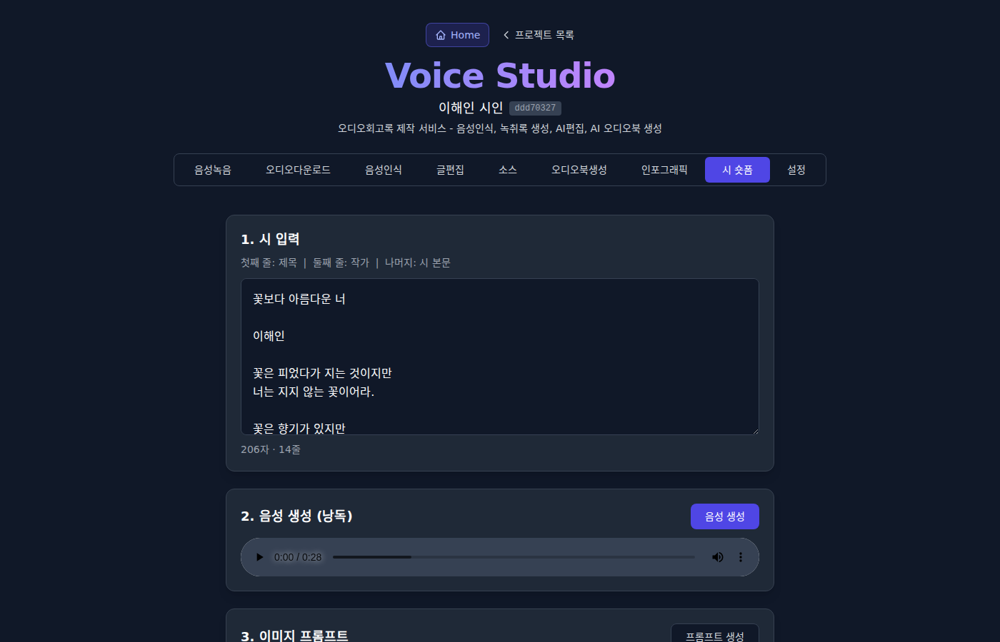
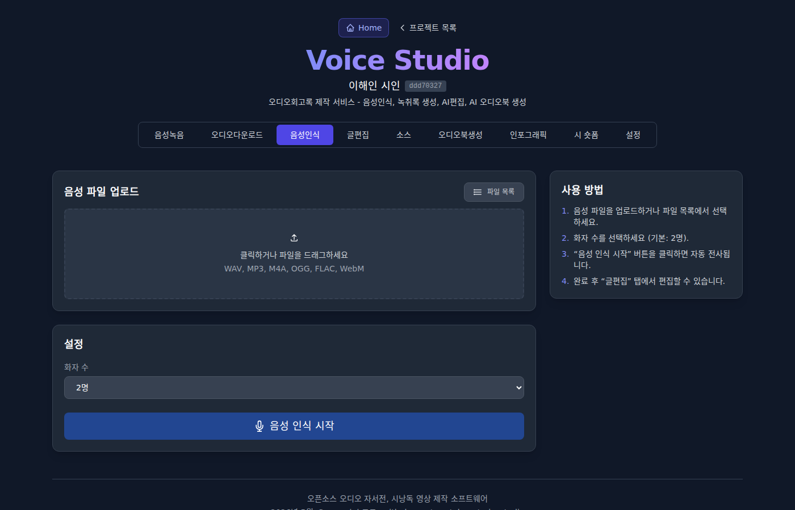

# Voice Studio

**오픈소스 오디오 자서전, 시낭독 영상 제작 소프트웨어**

Open-source audiobook & poetry short-form video production software

[](https://voice.iotok.org)
[](LICENSE)
[](https://python.org)
[](https://nextjs.org)

---

## 스크린샷 | Screenshots

| 프로젝트 목록 | 시 숏폼 영상 생성 | 음성인식 (ASR) |
|:---:|:---:|:---:|
|  |  |  |

> [라이브 데모](https://voice.iotok.org)에서 직접 확인하세요.

---

## 소개 | Introduction

### 한국어

Voice Studio는 AI를 활용한 오디오북 및 시낭독 영상 제작 플랫폼입니다. 음성 녹음부터 AI 음성인식, LLM 문체 변환, 음성 합성(TTS), 인포그래픽, 시 숏폼 영상 생성까지 전 과정을 하나의 웹 앱에서 처리할 수 있습니다.

**제작 목적**: AI 코딩 교육

### English

Voice Studio is an AI-powered audiobook and poetry short-form video production platform. It handles the entire workflow in a single web app — from audio recording and AI transcription, to LLM-based text rewriting, text-to-speech synthesis, infographic generation, and poetry short-form video creation.

**Purpose**: AI coding education

---

## 주요 기능 | Features

| 기능 | Feature | 설명 |
|------|---------|------|
| 음성녹음 | Audio Recording | 브라우저 녹음기, 파형 시각화 |
| 음성인식 | ASR | Groq Whisper large-v3 + WavLM 화자분리 |
| 글편집 | Text Editing | 오타 수정, LLM 문체 변환 (박완서 스타일) |
| 오디오북생성 | TTS | ElevenLabs (클라우드) + Qwen3-TTS (로컬 GPU) |
| 음성복제 | Voice Cloning | 참조 음성으로 Qwen3-TTS 음성 복제 |
| 배치 낭독 | Batch Narration | `<narration>` 태그로 여러 편 일괄 생성 |
| 인포그래픽 | Infographic | Gemini 2.5 Flash 이미지 생성 |
| 시 숏폼 | Poetry Shorts | AI 이미지 + TTS + 자막 → 숏폼 영상 |
| 비용 추적 | Cost Tracking | 단계별 토큰, API 비용 (USD/KRW) 표시 |
| 사용자 인증 | Auth | JWT 로그인/회원가입, 프로젝트 소유자 관리 |

---

## 아키텍처 | Architecture

```
Browser → Nginx (port 80) → /api/*  → FastAPI backend (port 4728)
          voice.iotok.org   /*      → Next.js frontend (port 4729)
          Cloudflare SSL
```

### 파이프라인 | Pipeline

```
1. 음성 녹음/업로드          →  2. AI 음성인식 (Groq Whisper + WavLM 화자분리)
       ↓                               ↓
3. 녹취록 편집               →  4. LLM 문체 변환 (오타 수정 / 문학적 변환)
       ↓                               ↓
5. TTS 음성 합성 (ElevenLabs 또는 Qwen3-TTS)
       ↓
6. 인포그래픽 생성 (Gemini 2.5 Flash)
       ↓
7. 시 숏폼 영상 생성 (이미지 + TTS + 자막 → ffmpeg)
```

---

## 기술 스택 | Tech Stack

| 구분 | 기술 |
|------|------|
| 프론트엔드 | Next.js 14, React 18, TypeScript 5, Tailwind CSS 3 |
| 백엔드 | FastAPI, Python 3.12, SQLite3 (WAL mode) |
| 음성인식 | Groq Whisper large-v3, WavLM 화자 임베딩 |
| TTS (클라우드) | ElevenLabs Flash v2.5 |
| TTS (로컬) | Qwen3-TTS-12Hz-1.7B-Base (NVIDIA GPU) |
| LLM | Claude Sonnet 4.6 (Anthropic), Qwen3-32B / Llama 3.3 (Groq) |
| 이미지 생성 | Gemini 2.5 Flash, wan2.7-image-pro (DashScope) |
| 영상 생성 | ffmpeg (libx264 + ASS 자막) |
| 인증 | JWT (PyJWT) |

---

## 설치 | Setup

### 필수 조건 | Prerequisites

- Python 3.12+
- Node.js 18+
- NVIDIA GPU (CUDA 12.1+) — 로컬 TTS용
- ffmpeg

### API 키 | API Keys

4개의 API 키가 필요합니다:

| 키 | 용도 |
|----|------|
| `GROQ_API_KEY` | 음성인식 (Whisper) + Groq LLM |
| `ANTHROPIC_API_KEY` | Claude LLM (문체 변환) |
| `ELEVENLABS_API_KEY` | 클라우드 TTS |
| `GOOGLE_API_KEY` | Gemini 인포그래픽 생성 |

### 백엔드 설치 | Backend Setup

```bash
cd backend
python -m venv venv
source venv/bin/activate
pip install -r requirements.txt

# 개발 서버
python -m uvicorn app.main:app --host 0.0.0.0 --port 4728 --reload
```

### 프론트엔드 설치 | Frontend Setup

```bash
cd frontend
npm install
npm run dev    # 개발 서버 (port 4729)
```

### 운영 배포 | Production Deployment

```bash
# 백엔드 — start.sh에 API 키 설정
cat > backend/start.sh << 'EOF'
#!/bin/bash
export GROQ_API_KEY="your-key"
export ANTHROPIC_API_KEY="your-key"
export ELEVENLABS_API_KEY="your-key"
export GOOGLE_API_KEY="your-key"
cd /path/to/backend
exec gunicorn -w 1 -k uvicorn.workers.UvicornWorker --bind 127.0.0.1:4728 --timeout 900 app.main:app
EOF
chmod +x backend/start.sh
./backend/start.sh

# 프론트엔드 — PM2 (빌드 전 .next 삭제 필수)
cd frontend && rm -rf .next && npm run build
pm2 start "npm start" --name frontend --cwd /path/to/frontend
```

---

## UI 탭 | UI Tabs

| 탭 | Tab | 설명 |
|----|-----|------|
| 음성녹음 | Recorder | 브라우저 녹음, 파형 시각화 |
| 오디오다운로드 | Download | YouTube 등 URL에서 오디오 다운로드 |
| 음성인식 | ASR | 오디오 → 녹취록 (화자 분리) |
| 글편집 | Editor | 녹취록 편집, 오타 수정, LLM 변환 |
| 소스 | Source | 원본/편집/변환 텍스트 비교, 시숏폼 요약 |
| 오디오북생성 | TTS | 이중 엔진 TTS, 배치 생성 |
| 인포그래픽 | Infographic | AI 인포그래픽 이미지 생성 |
| 시 숏폼 | Poetry Shorts | TTS + 이미지 + 자막 → 영상 |
| 설정 | Settings | TTS 엔진, LLM 모델 선택 |

---

## 배치 낭독 | Batch Narration

여러 편의 시나 글을 한 번에 오디오로 생성할 수 있습니다.

### 형식 | Format

```xml
<narration>
<title>제목</title>
<body>
본문 내용...
</body>
</narration>
```

### 예시 | Example

```xml
<narration>
<title>진달래꽃</title>
<body>
나 보기가 역겨워
가실 때에는
말없이 고이 보내 드리오리다.

영변에 약산
진달래꽃
아름 따다 가실 길에 뿌리오리다.
</body>
</narration>

<narration>
<title>서시</title>
<body>
죽는 날까지 하늘을 우러러
한 점 부끄럼이 없기를,
잎새에 이는 바람에도
나는 괴로워했다.

별을 노래하는 마음으로
모든 죽어 가는 것을 사랑해야지.
</body>
</narration>
```

### 사용법 | How to Use

1. **오디오북생성** 탭에서 태그된 텍스트를 붙여넣기
2. **Batch: N편** 배지가 자동으로 표시됨
3. **Generate Speech** 클릭 → 순차적으로 생성
4. 출력 파일명: `{제목}_{음성}.wav`
5. 생성 중 **Batch 중단**으로 중지 가능

---

## 비용 | Cost

| 서비스 | 비용 |
|--------|------|
| 음성인식 (Groq Whisper) | 무료 (Groq 무료 티어) |
| LLM 오타수정/변환 (Claude Sonnet) | $3/$15 per 1M tokens |
| LLM (Groq Qwen3/Llama) | $0.05~$0.59 per 1M tokens |
| TTS - ElevenLabs | $0.30 per 1K chars |
| TTS - Qwen3-TTS (로컬) | 무료 (GPU 전력비만) |
| 이미지 생성 (wan2.7) | ~$0.02 per image |
| 영상 생성 (ffmpeg) | 무료 (로컬) |

프로젝트별로 각 단계의 토큰 사용량과 비용이 USD/KRW로 자동 계산됩니다.

---

## 프로젝트 구조 | Project Structure

```
voicestudio/
├── frontend/                 # Next.js 프론트엔드
│   ├── app/
│   │   ├── page.tsx          # 메인 SPA (~4000줄)
│   │   ├── layout.tsx        # SEO 메타태그
│   │   ├── globals.css       # 글로벌 스타일
│   │   ├── sitemap.ts        # 사이트맵
│   │   └── robots.ts         # 크롤러 설정
│   └── package.json
├── backend/                  # FastAPI 백엔드
│   ├── app/
│   │   ├── main.py           # API 라우트, SSE 스트리밍
│   │   ├── auth.py           # JWT 인증
│   │   ├── database.py       # SQLite3 DB
│   │   ├── models.py         # Pydantic 스키마
│   │   ├── tts_service.py    # Qwen3-TTS 로컬 GPU
│   │   ├── elevenlabs_service.py  # ElevenLabs 클라우드 TTS
│   │   ├── asr_service.py    # Whisper + WavLM 화자분리
│   │   └── video_service.py  # 시 숏폼 영상 생성
│   ├── voices/               # Qwen3 프리셋 음성
│   ├── uploads/              # 업로드된 음성
│   ├── outputs/              # 생성된 오디오
│   ├── audio_files/          # 인터뷰 원본 오디오
│   ├── artifacts/            # 텍스트 아티팩트
│   ├── infographics/         # 생성된 인포그래픽
│   ├── videos/               # 생성된 영상
│   └── projects.db           # SQLite DB
├── CLAUDE.md                 # AI 코딩 어시스턴트 가이드
└── README.md
```

---

## 기여 | Contributing

이슈와 PR을 환영합니다. 이 프로젝트는 AI 코딩 교육 목적으로 만들어졌습니다.

Issues and pull requests are welcome. This project was built for AI coding education purposes.

---

## 연락처 | Contact

- **제작자**: Muntak Son
- **이메일**: mtshon@gmail.com
- **GitHub**: [github.com/muntakson/voicestudio](https://github.com/muntakson/voicestudio)

---

## 라이선스 | License

[GNU General Public License v3.0](LICENSE)
